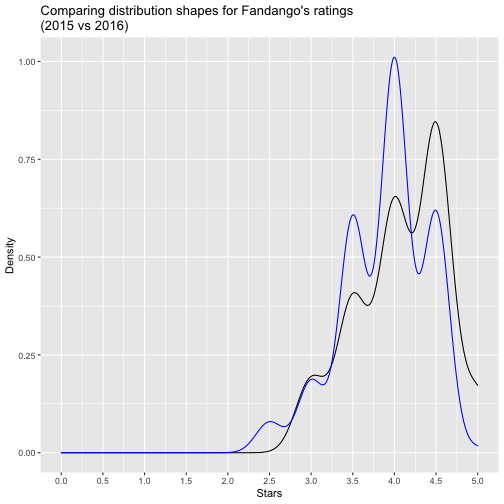
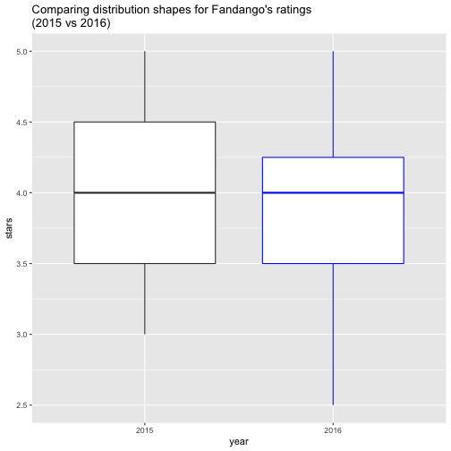
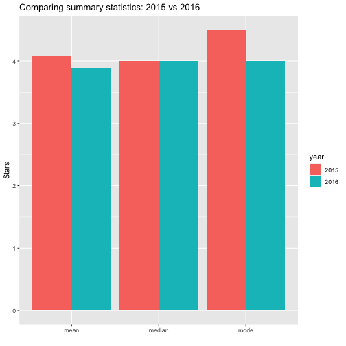

```r
library(tidyverse)
```

```
## ── Attaching packages ──────────────────────────────────────────────────────────────────────── tidyverse 1.3.2 ──
## ✔ ggplot2 3.3.6      ✔ purrr   0.3.5 
## ✔ tibble  3.1.8      ✔ dplyr   1.0.10
## ✔ tidyr   1.2.1      ✔ stringr 1.4.1 
## ✔ readr   2.1.3      ✔ forcats 0.5.2 
## ── Conflicts ─────────────────────────────────────────────────────────────────────────── tidyverse_conflicts() ──
## ✖ dplyr::filter() masks stats::filter()
## ✖ dplyr::lag()    masks stats::lag()
```

```r
library(ggplot2)
```


# Introduction

In October 2015, a data journalist named Walt Hickey analyzed movie ratings data and found strong evidence to suggest that Fandango's rating system was biased and dishonest ([Fandango](https://www.fandango.com/) is an online movie ratings aggregator). He published his analysis in this [article](https://fivethirtyeight.com/features/fandango-movies-ratings/) — a great piece of data journalism that's totally worth reading.

Fandango displays a 5-star rating system on their website, where the minimum rating is 0 stars and the maximum is 5 stars.

Hickey found that there's a significant discrepancy between the number of stars displayed to users and the actual rating, which he was able to find in the HTML of the page. He was able to find that:

* The actual rating was almost always rounded up to the nearest half-star. For instance, a 4.1 movie would be rounded off to 4.5 stars, not to 4 stars, as you may expect.
* In the case of 8% of the ratings analyzed, the rounding up was done to the nearest whole star. For instance, a 4.5 rating would be rounded off to 5 stars.
* For one movie rating, the rounding off was completely bizarre: from a rating of 4 in the HTML of the page to a displayed rating of 5 stars.

The two distributions above are displayed using a simple line plot, which is also a valid way to show the shape of a distribution. The variable being examined is movie rating, and for each unique rating we can see its relative frequency (percentage) on the y-axis of the graph. When an analysis report is intended for large audiences, relative frequencies (especially percentages) are preferred over absolute frequencies.

Both distributions above are strongly left-skewed, suggesting that movie ratings on Fandango are generally high or very high. We can see there's no rating under 2 stars in the sample Hickey analyzed. The distribution of displayed ratings is clearly shifted to the right compared to the actual rating distribution, suggesting strongly that Fandango inflates the ratings under the hood.

Fandango's officials replied that the biased rounding off was caused by a bug in their system rather than being intentional, and they promised to fix the bug as soon as possible. Presumably, this has already happened, although we can't tell for sure since the actual rating value doesn't seem to be displayed anymore in the pages' HTML.

In this project, we'll analyze more recent movie ratings data to determine whether there has been any change in Fandango's rating system after Hickey's analysis.

## Understanding the Data

One of the best ways to figure out whether there has been any change in Fandango's rating system after Hickey's analysis is to compare the system's characteristics previous and after the analysis. Fortunately, we have ready-made data for both these periods of time:


```r
fandango_score_comparison <-  read_csv('fandango_score_comparison.csv')
```

```
## Rows: 146 Columns: 22
## ── Column specification ─────────────────────────────────────────────────────────────────────────────────────────
## Delimiter: ","
## chr  (1): FILM
## dbl (21): RottenTomatoes, RottenTomatoes_User, Metacritic, Metacritic_User, IMDB, Fandango_Stars, Fandango_Ra...
## 
## ℹ Use `spec()` to retrieve the full column specification for this data.
## ℹ Specify the column types or set `show_col_types = FALSE` to quiet this message.
```

```r
movie_ratings_16_17 <- read_csv('movie_ratings_16_17.csv')
```

```
## Rows: 214 Columns: 15
## ── Column specification ─────────────────────────────────────────────────────────────────────────────────────────
## Delimiter: ","
## chr  (1): movie
## dbl (14): year, metascore, imdb, tmeter, audience, fandango, n_metascore, n_imdb, n_tmeter, n_audience, nr_me...
## 
## ℹ Use `spec()` to retrieve the full column specification for this data.
## ℹ Specify the column types or set `show_col_types = FALSE` to quiet this message.
```


```r
previous <- fandango_score_comparison %>% 
  select('FILM', 'Fandango_Stars', 'Fandango_Ratingvalue', 'Fandango_votes', 'Fandango_Difference')

after <- movie_ratings_16_17 %>% 
  select('movie', 'year', 'fandango')

head(previous)
```

```
## # A tibble: 6 × 5
##   FILM                           Fandango_Stars Fandango_Ratingvalue Fandango_votes Fandango_Difference
##   <chr>                                   <dbl>                <dbl>          <dbl>               <dbl>
## 1 Avengers: Age of Ultron (2015)            5                    4.5          14846                 0.5
## 2 Cinderella (2015)                         5                    4.5          12640                 0.5
## 3 Ant-Man (2015)                            5                    4.5          12055                 0.5
## 4 Do You Believe? (2015)                    5                    4.5           1793                 0.5
## 5 Hot Tub Time Machine 2 (2015)             3.5                  3             1021                 0.5
## 6 The Water Diviner (2015)                  4.5                  4              397                 0.5
```

```r
head(after)
```

```
## # A tibble: 6 × 3
##   movie                    year fandango
##   <chr>                   <dbl>    <dbl>
## 1 10 Cloverfield Lane      2016      3.5
## 2 13 Hours                 2016      4.5
## 3 A Cure for Wellness      2016      3  
## 4 A Dog's Purpose          2017      4.5
## 5 A Hologram for the King  2016      3  
## 6 A Monster Calls          2016      4
```

Our goal is to determine whether there has been any change in Fandango's rating system after Hickey's analysis. The population of interest for our analysis is made of all the movie ratings stored on Fandango's website, regardless of the releasing year.

Because we want to find out whether the parameters of this population changed after Hickey's analysis, we're interested in sampling the population at two different periods in time — previous and after Hickey's analysis — so we can compare the two states.

The data we're working with was sampled at the moments we want: one sample was taken previous to the analysis, and the other after the analysis. We want to describe the population, so we need to make sure that the samples are representative, otherwise we should expect a large sampling error and, ultimately, wrong conclusions.

From Hickey's article and from the README.md of [the data set's repository](https://github.com/fivethirtyeight/data/tree/master/fandango), we can see that he used the following sampling criteria:

* The movie must have had at least 30 fan ratings on Fandango's website at the time of sampling (Aug. 24, 2015).
* The movie must have had tickets on sale in 2015.

The sampling was clearly not random because not every movie had the same chance to be included in the sample — some movies didn't have a chance at all (like those having under 30 fan ratings or those without tickets on sale in 2015). It's questionable whether this sample is representative of the entire population we're interested to describe. It seems more likely that it isn't, mostly because this sample is subject to temporal trends — e.g. movies in 2015 might have been outstandingly good or bad compared to other years.

The sampling conditions for our other sample were (as it can be read in the README.md of [the data set's repository](https://github.com/mircealex/Movie_ratings_2016_17)):

* The movie must have been released in 2016 or later.
* The movie must have had a considerable number of votes and reviews (unclear how many from the README.md or from the data).

This second sample is also subject to temporal trends and it's unlikely to be representative of our population of interest.

Both these authors had certain research questions in mind when they sampled the data, and they used a set of criteria to get a sample that would fit their questions. Their sampling method is called [purposive sampling](https://www.youtube.com/watch?v=CdK7N_kTzHI&feature=youtu.be) (or judgmental/selective/subjective sampling). While these samples were good enough for their research, they don't seem too useful for us.

## Changing the Goal of our Analysis

At this point, we can either collect new data or change our the goal of our analysis. We choose the latter and place some limitations on our initial goal.

Instead of trying to determine whether there has been any change in Fandango's rating system after Hickey's analysis, our new goal is to determine whether there's any difference between Fandango's ratings for popular movies in 2015 and Fandango's ratings for popular movies in 2016. This new goal should also be a fairly good proxy for our initial goal.

With the new goal, we now have two populations that we want to describe and compare with each other:

* All Fandango's ratings for popular movies released in 2015.
* All Fandango's ratings for popular movies released in 2016.

## Isolating the Samples We Need

We need to be clear about what counts as popular movies. We'll use Hickey's benchmark of 30 fan ratings and count a movie as popular only if it has 30 fan ratings or more on Fandango's website.

Although one of the sampling criteria in our second sample is movie popularity, the `fandango_after` dataframe doesn't provide information about the number of fan ratings. We should be skeptical once more and ask whether this sample is truly representative and contains popular movies (movies with over 30 fan ratings).

One quick way to check the representativity of this sample might be to sample randomly 10 movies from it and then check the number of fan ratings ourselves on Fandango's website. 


```r
set.seed(1)
sample_n(after, size = 10)
```

```
## # A tibble: 10 × 3
##    movie                     year fandango
##    <chr>                    <dbl>    <dbl>
##  1 Hands of Stone            2016      4  
##  2 The Bye Bye Man           2017      3  
##  3 Our Kind of Traitor       2016      3.5
##  4 The Autopsy of Jane Doe   2016      4.5
##  5 Dirty Grandpa             2016      3.5
##  6 Arsenal                   2017      3.5
##  7 The Light Between Oceans  2016      4  
##  8 Exposed                   2016      2.5
##  9 Jason Bourne              2016      4  
## 10 Before I Fall             2017      3.5
```
Above we used a value of 1 as the random seed. This is good practice because it suggests that we weren't trying out various random seeds just to get a favorable sample.

After checking the number of fan ratings for the movies above, we discover that as of August, 2019 Fandango no longer uses the 5-Star Fan Ratings described above. Instead, Fandango now uses the [Rotten Tomatoes verified Audience Score](https://editorial.rottentomatoes.com/article/introducing-verified-audience-score/). These are the number of fan ratings we found on [Rotten Tomatoes](https://www.rottentomatoes.com/):


```r
set.seed(1)
sampled <- sample_n(after, size = 10)
# Create a single column tibble of Rotten Tomato review counts
reviews <- tibble(reviews = c(13569, 74904, 24293, 4141, 30183, 48952, 14328, 59359, 54765, 82222))
bind_cols(sampled, reviews)
```

```
## # A tibble: 10 × 4
##    movie                     year fandango reviews
##    <chr>                    <dbl>    <dbl>   <dbl>
##  1 Hands of Stone            2016      4     13569
##  2 The Bye Bye Man           2017      3     74904
##  3 Our Kind of Traitor       2016      3.5   24293
##  4 The Autopsy of Jane Doe   2016      4.5    4141
##  5 Dirty Grandpa             2016      3.5   30183
##  6 Arsenal                   2017      3.5   48952
##  7 The Light Between Oceans  2016      4     14328
##  8 Exposed                   2016      2.5   59359
##  9 Jason Bourne              2016      4     54765
## 10 Before I Fall             2017      3.5   82222
```

All ten movies sampled have well above 30 fan ratings, but it is possible that the Rotten Tomatoes Verified Audience user base is larger than the Fandango user base. We cannot really say with confidence whether these review numbers are comparable to the Fandango fan ratings. In addition, time has passed since Hickey's analysis, giving more fans an opportunity to submit reviews. So even if we did still have access to Fandango's 5-star fan ratings, we would have no way to compare the number of fan ratings we see to the number that Hickey observed. 

Let's move on to the `previous` dataframe that does include the number of fan ratings for each movie. The documentation states clearly that there are only movies with at least 30 fan ratings, but it should take only a couple of seconds to double-check here.


```r
sum(previous$Fandango_votes < 30)
```

```
## [1] 0
```

If you explore the two data sets, you'll notice that there are movies with a releasing year different than 2015 or 2016. 


```r
head(previous$FILM, n = 10)
```

```
##  [1] "Avengers: Age of Ultron (2015)" "Cinderella (2015)"              "Ant-Man (2015)"                
##  [4] "Do You Believe? (2015)"         "Hot Tub Time Machine 2 (2015)"  "The Water Diviner (2015)"      
##  [7] "Irrational Man (2015)"          "Top Five (2014)"                "Shaun the Sheep Movie (2015)"  
## [10] "Love & Mercy (2015)"
```


```r
unique(after$year)
```

```
## [1] 2016 2017
```

For our purposes, we'll need to isolate only the movies released in 2015 and 2016.


```r
previous <- previous %>% 
  mutate(year = str_sub(FILM, -5, -2))
```

Let's examine the frequency distribution for the Year column and then isolate the movies released in 2015.


```r
previous %>% 
  group_by(year) %>% 
  summarize(Freq = n())
```

```
## # A tibble: 2 × 2
##   year   Freq
##   <chr> <int>
## 1 2014     17
## 2 2015    129
```
Alternatively, we can use the base R `table()` function because we only need to get a quick view of the distribution.


```r
table(previous$year)
```

```
## 
## 2014 2015 
##   17  129
```


```r
fandango_2015 <- previous %>% 
  filter(year == 2015)
table(fandango_2015$year)
```

```
## 
## 2015 
##  129
```

Great, now let's isolate the movies in the other data set.

```r
head(after)
```

```
## # A tibble: 6 × 3
##   movie                    year fandango
##   <chr>                   <dbl>    <dbl>
## 1 10 Cloverfield Lane      2016      3.5
## 2 13 Hours                 2016      4.5
## 3 A Cure for Wellness      2016      3  
## 4 A Dog's Purpose          2017      4.5
## 5 A Hologram for the King  2016      3  
## 6 A Monster Calls          2016      4
```


```r
table(after$year)
```

```
## 
## 2016 2017 
##  191   23
```


```r
fandango_2016 <- after %>% 
  filter(year == 2016)
table(fandango_2016$year)
```

```
## 
## 2016 
##  191
```

## Comparing Distribution Shapes for 2015 and 2016

After all these preliminary steps, we can now start analyzing the two samples we previously isolated. Once again, our goal is to determine whether there's any difference between Fandango's ratings for popular movies in 2015 and Fandango's ratings for popular movies in 2016.

We'll start with comparing the shape of the two distributions using kernel density plots.


```r
# 2015 dataframe is specified in the ggplot call
ggplot() +
  geom_density(data = fandango_2015, 
               aes(x = Fandango_Stars)) +
  # 2016 dataframe is specified in the second geom_density() call
  geom_density(data = fandango_2016, 
               aes(x = fandango), color = "blue") +
  labs(title = "Comparing distribution shapes for Fandango's ratings\n(2015 vs 2016)",
       x = "Stars",
       y = "Density") +
  scale_x_continuous(breaks = seq(0, 5, by = 0.5), 
                     limits = c(0, 5))
```



```r
ggplot() +
  geom_boxplot(data = fandango_2015, 
               aes(x= '2015',
                   y = Fandango_Stars)) +
  # 2016 dataframe is specified in the second geom_density() call
  geom_boxplot(data = fandango_2016, 
               aes(x= '2016',
                   y = fandango), color = "blue") +
  labs(title = "Comparing distribution shapes for Fandango's ratings\n(2015 vs 2016)",
       x = "year",
       y = "stars") 
```



Two aspects are striking on the figure above:

* Both distributions are strongly left skewed.
* The 2016 distribution is slightly shifted to the left relative to the 2015 distribution.

The left skew suggests that movies on Fandango are given mostly high and very high fan ratings. Coupled with the fact that Fandango sells tickets, the high ratings are a bit dubious. It'd be really interesting to investigate this further — ideally in a separate project, since this is quite irrelevant for the current goal of our analysis.

The slight left shift of the 2016 distribution is very interesting for our analysis. It shows that ratings were slightly lower in 2016 compared to 2015. This suggests that there was a difference indeed between Fandango's ratings for popular movies in 2015 and Fandango's ratings for popular movies in 2016. We can also see the direction of the difference: the ratings in 2016 were slightly lower compared to 2015.


```r
fandango_2015 %>% 
  group_by(Fandango_Stars) %>% 
  summarize(Percentage = n() / nrow(fandango_2015) * 100)
```

```
## # A tibble: 5 × 2
##   Fandango_Stars Percentage
##            <dbl>      <dbl>
## 1            3         8.53
## 2            3.5      17.8 
## 3            4        28.7 
## 4            4.5      38.0 
## 5            5         6.98
```


```r
fandango_2016 %>% 
  group_by(fandango) %>% 
  summarize(Percentage = n() / nrow(fandango_2016) * 100)
```

```
## # A tibble: 6 × 2
##   fandango Percentage
##      <dbl>      <dbl>
## 1      2.5      3.14 
## 2      3        7.33 
## 3      3.5     24.1  
## 4      4       40.3  
## 5      4.5     24.6  
## 6      5        0.524
```

In 2016, very high ratings (4.5 and 5 stars) had lower percentages compared to 2015. In 2016, under 1% of the movies had a perfect rating of 5 stars, compared to 2015 when the percentage was close to 7%. Ratings of 4.5 were also more popular in 2015 — there were approximately 13% more movies rated with a 4.5 in 2015 compared to 2016.

The minimum rating is also lower in 2016 — 2.5 instead of 3 stars, the minimum of 2015. There clearly is a difference between the two frequency distributions.

For some other ratings, the percentage went up in 2016. There was a greater percentage of movies in 2016 that received 3.5 and 4 stars, compared to 2015. 3.5 and 4.0 are high ratings and this challenges the direction of the change we saw on the kernel density plots.

### Determining the Direction of the Change

Let's take a couple of summary metrics to get a more precise picture about the direction of the change. In what follows, we'll compute the mean, the median, and the mode for both distributions and then use a bar graph to plot the values.


```r
# Mode function from stackoverflow
mode <- function(x) {
  ux <- unique(x)
  ux[which.max(tabulate(match(x, ux)))]
}

summary_2015 <- fandango_2015 %>% 
  summarize(year = "2015",
    mean = mean(Fandango_Stars),
    median = median(Fandango_Stars),
    mode = mode(Fandango_Stars))
summary_2016 <- fandango_2016 %>% 
  summarize(year = "2016",
            mean = mean(fandango),
            median = median(fandango),
            mode = mode(fandango))
# Combine 2015 & 2016 summary dataframes
summary_df <- bind_rows(summary_2015, summary_2016)
# Gather combined dataframe into a format ready for ggplot
summary_df <- summary_df %>% 
  pivot_longer( cols= c(mean, median, mode), values_to = 'value', names_to = 'statistic')%>%
  arrange(statistic, year)
#  gather(key = "statistic", value = "value", - year)
summary_df
```

```
## # A tibble: 6 × 3
##   year  statistic value
##   <chr> <chr>     <dbl>
## 1 2015  mean       4.09
## 2 2016  mean       3.89
## 3 2015  median     4   
## 4 2016  median     4   
## 5 2015  mode       4.5 
## 6 2016  mode       4
```


```r
ggplot(data = summary_df, aes(x = statistic, y = value, fill = year)) +
  geom_bar(stat = "identity", position = "dodge") +
  labs(title = "Comparing summary statistics: 2015 vs 2016",
       x = "",
       y = "Stars")
```



The mean rating was lower in 2016 with approximately 0.2. This means a drop of almost 5% relative to the mean rating in 2015.


```r
means <- summary_df %>% 
  filter(statistic == "mean")
means %>% 
  summarize(change = (value[1] - value[2]) / value[1])
```

```
## # A tibble: 1 × 1
##   change
##    <dbl>
## 1 0.0484
```
While the median is the same for both distributions, the mode is lower in 2016 by 0.5. Coupled with what we saw for the mean, the direction of the change we saw on the kernel density plot is confirmed: on average, popular movies released in 2016 were rated slightly lower than popular movies released in 2015.

# Conclusion

Our analysis showed that there's indeed a slight difference between Fandango's ratings for popular movies in 2015 and Fandango's ratings for popular movies in 2016. We also determined that, on average, popular movies released in 2016 were rated lower on Fandango than popular movies released in 2015.

We cannot be completely sure what caused the change, but the chances are very high that it was caused by Fandango fixing the biased rating system after Hickey's analysis.


